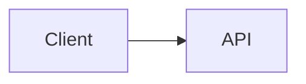
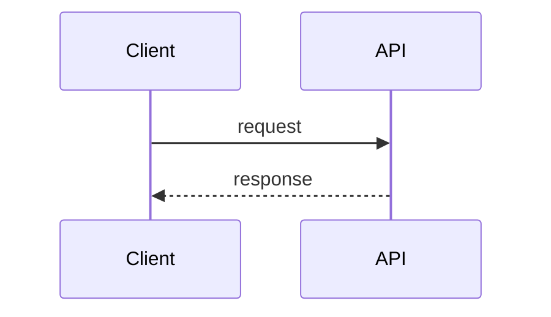
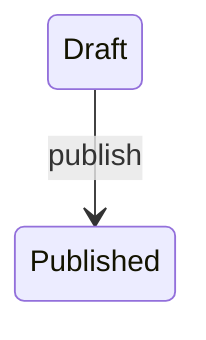
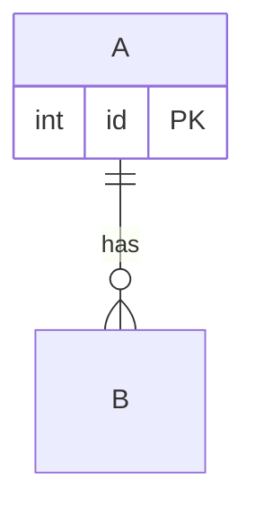
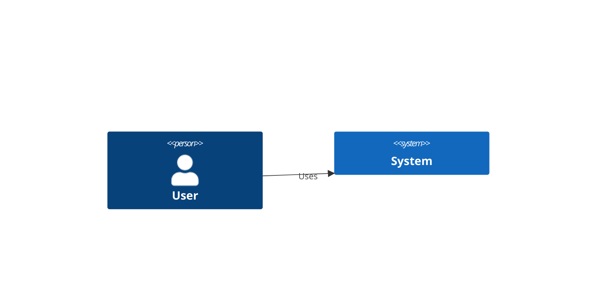
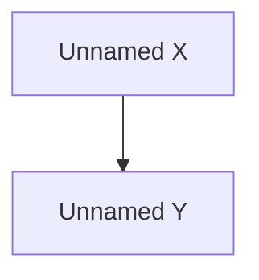

# Embedded diagrams of every family

## Flow

```mermaid
%% archer-id: flow
flowchart LR
  a[Client] call@--> b[API]
```

## Sequence

```mermaid
%% archer-id: seq
sequenceDiagram
  participant a as Client
  participant b as API
  a->>b: request
  b-->>a: response
```

## State

```mermaid
%% archer-id: state
stateDiagram-v2
  state Draft
  state Published
  Draft --> Published : publish
```

## ER

```mermaid
%% archer-id: er
erDiagram
  A {
    int id PK
  }
  B
  A ||--o{ B : has
```

## C4

```mermaid
%% archer-id: c4
C4Context
  Person(u, "User")
  System(s, "System")
  Rel(u, s, "Uses")
```

Unnamed, after prose with `code`, **bold** and a [link](../diagrams/flow-styled.mmd):

```mermaid
flowchart TB
  x[Unnamed X] xy@--> y[Unnamed Y]
```
