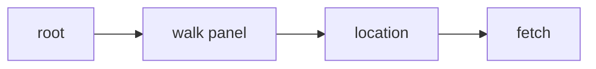

# root

# __archerTelemetry

# archer-walk-panel

## getElementById

Headings whose words match ids and globals the page reads. Their anchors must stay namespaced.

```mermaid
%% archer-id: clobber
flowchart LR
  root[root] e1@--> archer-walk-panel[walk panel]
  archer-walk-panel e2@--> location[location]
  location e3@--> fetch[fetch]
```
