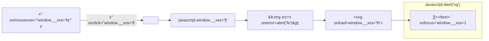
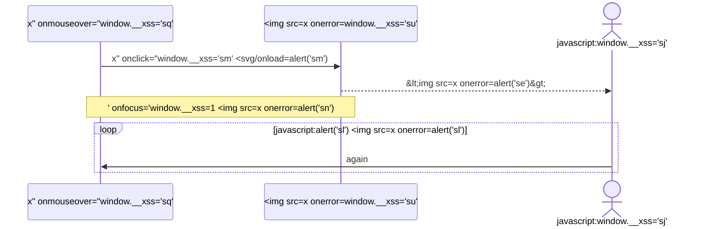
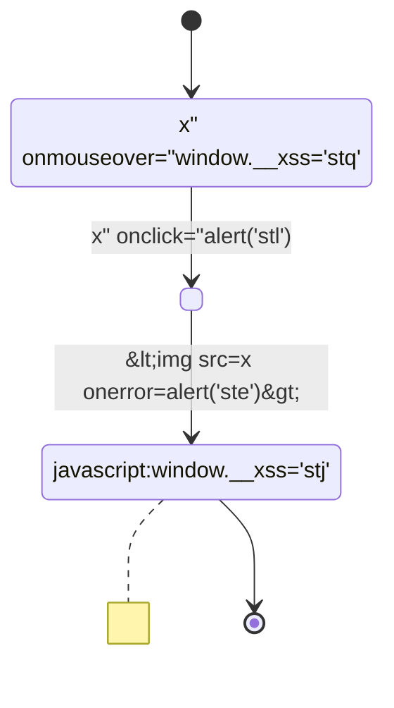
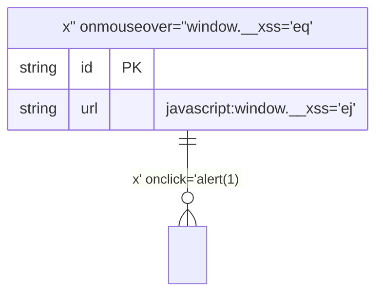
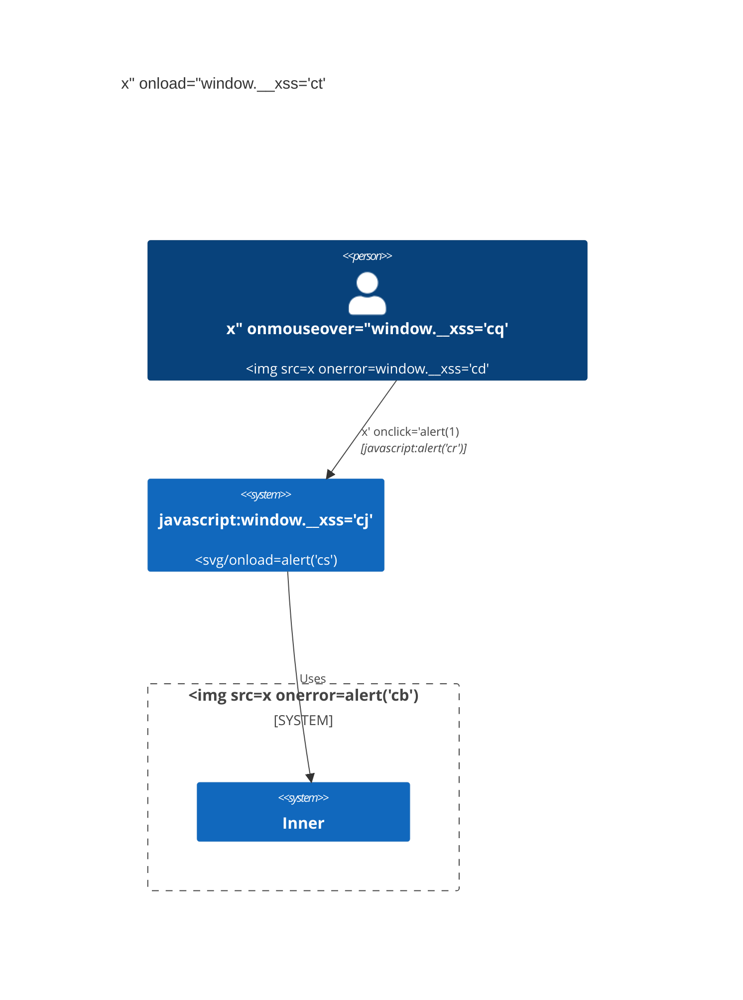
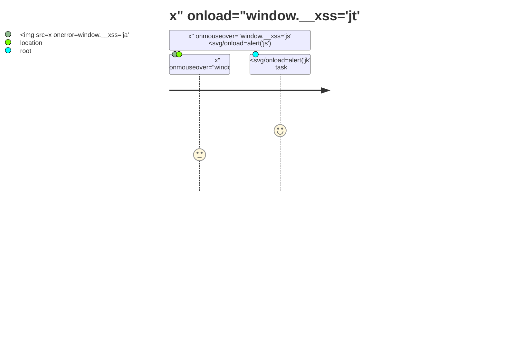

# Embedded figures

## flow

```mermaid
%% archer-id: flow-fig
flowchart LR
  root["x#quot; onmouseover=#quot;window.__xss='fq'#quot; y"]
  archer-walk-panel["<img src=x onerror=window.__xss='fu' "]
  location["javascript:window.__xss='fj'"]
  b["#38;lt#59;img src=x onerror=alert('fe')#38;gt#59;"]
  c["&lt;svg onload=window.__xss='fh'&gt;"]
  d["]]&gt;&lt;/text&gt; ' onfocus='window.__xss=1"]
  root e1@-->|"x#quot; onclick=#quot;window.__xss='fl'"| archer-walk-panel
  archer-walk-panel e2@-->|"<svg/onload=alert('fl2') "| location
  location e3@--> b
  b e4@--> c
  c e5@--> d
  subgraph g["javascript:alert('sg') <img src=x onerror=alert('sg') "]
    d
  end
```

## seq

```mermaid
%% archer-id: seq-fig
sequenceDiagram
  participant root as x" onmouseover="window.__xss='sq'
  participant location as <img src=x onerror=window.__xss='su'
  actor u as javascript:window.__xss='sj'
  root->>location: x" onclick="window.__xss='sm' <svg/onload=alert('sm')
  location-->>u: #38;lt#59;img src=x onerror=alert('se')#38;gt#59;
  Note over root,location: ' onfocus='window.__xss=1 <img src=x onerror=alert('sn')
  loop javascript:alert('sl') <img src=x onerror=alert('sl')
    u->>root: again
  end
```

## state

```mermaid
%% archer-id: state-fig
stateDiagram-v2
  state "x#quot; onmouseover=#quot;window.__xss='stq'" as idle
  location : <img src=x onerror=window.__xss='stu'
  state "javascript:window.__xss='stj'" as Other
  [*] --> idle
  idle --> location : x" onclick="alert('stl') <svg/onload=alert('stl')
  location --> Other : #38;lt#59;img src=x onerror=alert('ste')#38;gt#59;
  note right of Other : <img src=x onerror=alert('stn')
  Other --> [*]
```

## er

```mermaid
%% archer-id: er-fig
erDiagram
  ROOT["x#quot; onmouseover=#quot;window.__xss='eq'"] {
    string id PK "<img src=x onerror=window.__xss='ec'"
    string url "javascript:window.__xss='ej'"
  }
  LOCATION["<svg/onload=window.__xss='eu' "]
  ROOT ||--o{ LOCATION : "x' onclick='alert(1) <img src=x onerror=alert('el')"
```

## c4

```mermaid
%% archer-id: c4-fig
C4Context
  title x" onload="window.__xss='ct' <img src=x onerror=alert('ct')
  Person(root, "x#quot; onmouseover=#quot;window.__xss='cq'", "<img src=x onerror=window.__xss='cd'")
  System(location, "javascript:window.__xss='cj'", "<svg/onload=alert('cs')")
  System_Boundary(b1, "<img src=x onerror=alert('cb')") {
    System(inner, "Inner")
  }
  Rel(root, location, "x' onclick='alert(1)", "javascript:alert('cr')")
  Rel(location, inner, "Uses")
```

## arch

```mermaid
%% archer-id: arch-fig
architecture-beta
  title x" onload="window.__xss='at'
  group root(cloud)[x" onmouseover="window.__xss='ag']
  service location(server)[<img src=x onerror=window.__xss='au' ] in root
  service other(database)[javascript:window.__xss='aj'] in root
  location:R -[x' onclick='alert(1) <svg/onload=alert('ae')]-> L:other
```

## journey

```mermaid
%% archer-id: journey-fig
journey
  title x" onload="window.__xss='jt' <img src=x onerror=alert('jt')
  section x" onmouseover="window.__xss='js' <svg/onload=alert('js')
    x" onmouseover="window.__xss='jq': 3: <img src=x onerror=window.__xss='ja' , location
    <svg/onload=alert('jk') task: 5: root
```
